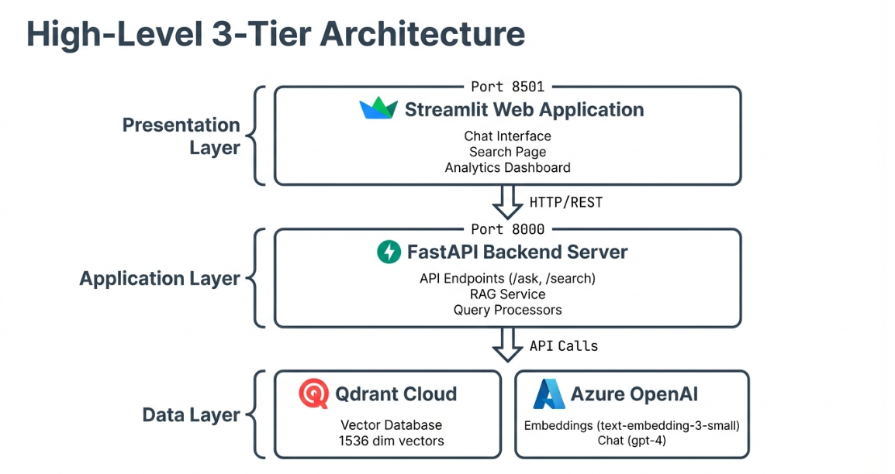
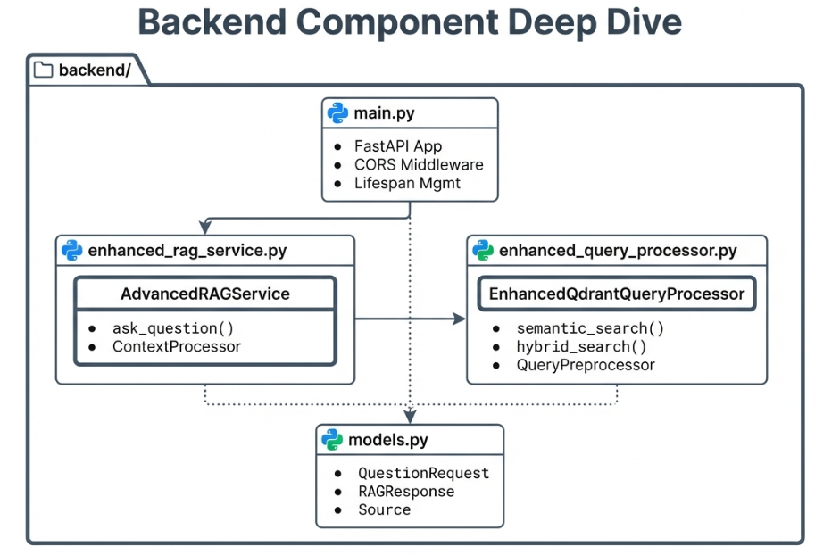
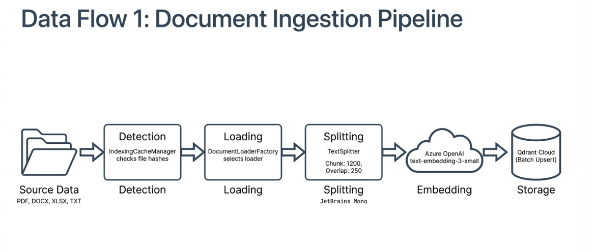
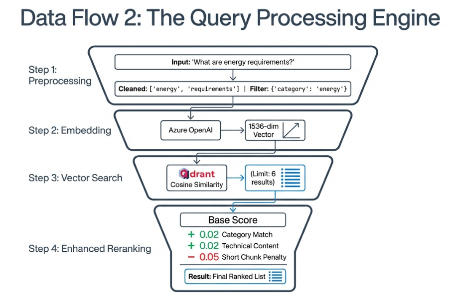
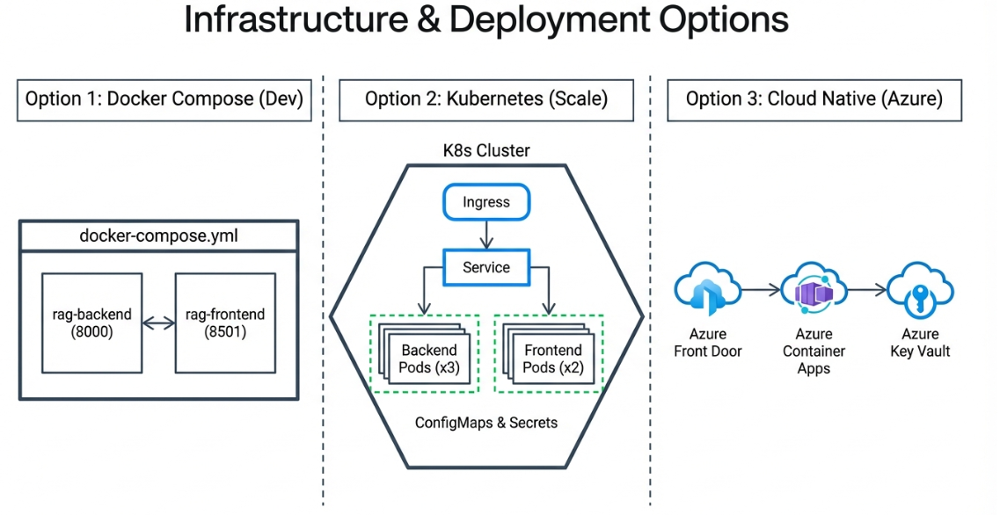
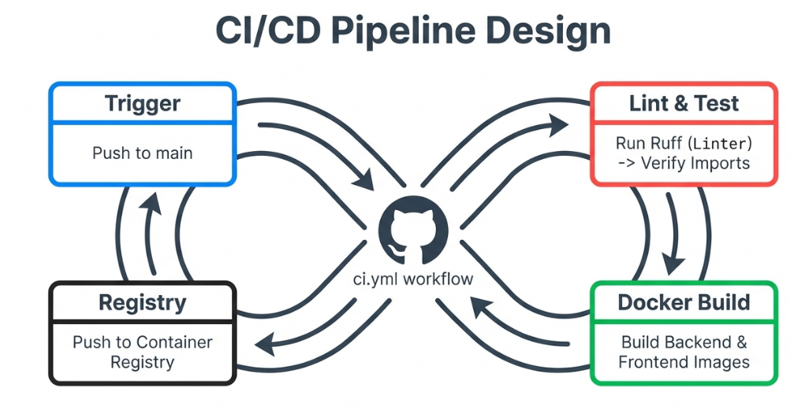

# RAG Real Estate Document Assistant

<div align="center">


**An intelligent AI-powered document assistant for the real estate industry**

*Transform your property documents, contracts, and building specifications into an interactive knowledge base with instant answers powered by advanced RAG technology.*

[Getting Started](#installation) | [Documentation](ARCHITECTURE.md) | [API Reference](#api-reference) | [Contributing](#contributing)

</div>

---

## Overview

The **RAG Real Estate Document Assistant** is an enterprise-grade Retrieval-Augmented Generation (RAG) system specifically designed for the **real estate and property management industry**. It enables intelligent question-answering over complex document collections including:

- Property evaluation reports and audits
- Building energy assessments (HEA, ENE certifications)
- Construction specifications and technical documents
- Legal contracts and compliance documentation
- Floor plans and architectural specifications

Built with **FastAPI**, **Streamlit**, **Azure OpenAI**, and **Qdrant** vector database, this system delivers accurate, context-aware responses grounded in your actual documents.

---

## Key Features

| Feature | Description |
|---------|-------------|
| **Multi-Format Support** | Process PDF, DOCX, TXT, and XLSX documents automatically |
| **Semantic Search** | Find relevant information using natural language, not just keywords |
| **Source Attribution** | Every answer includes references to original documents |
| **Domain-Aware Processing** | Specialized handling for energy, water, transport, and regulatory categories |
| **Confidence Scoring** | Know how reliable each answer is based on source quality |
| **Follow-up Suggestions** | Intelligent recommendations for deeper exploration |
| **Incremental Indexing** | Only process new or modified documents |
| **Production Ready** | Docker support, CI/CD pipeline, and comprehensive logging |

---

## Problem Statement

Real estate professionals manage vast amounts of technical documentation:

- **Building audits** with hundreds of pages of technical specifications
- **Energy certifications** (HEA, ENE, TRA) with complex requirements
- **Property evaluations** spread across multiple file formats
- **Regulatory compliance** documents that change frequently

**Traditional challenges:**
- Keyword search fails to understand context ("energy requirements" vs "power consumption")
- Manual document review is time-consuming and error-prone
- Critical information is buried in lengthy technical reports
- No single source of truth across document collections

**Our solution:** An AI assistant that understands your documents and answers questions instantly with full source traceability.

---

## Architecture

For comprehensive architecture documentation, see [ARCHITECTURE.md](ARCHITECTURE.md).

### High-Level System Overview

<div align="center">



*End-to-end flow from document ingestion to intelligent answer generation*

</div>

The system follows a modern RAG architecture:

1. **Document Ingestion** - Process and chunk documents from multiple formats
2. **Vector Storage** - Store embeddings in Qdrant for fast similarity search
3. **RAG Pipeline** - Retrieve context and generate grounded answers
4. **Answer Generation** - Produce accurate responses with source citations

---

### Three-Tier Architecture

<div align="center">


*Presentation layer with Streamlit web application*

</div>

```
┌─────────────────────────────────────────────────────────────────────────────┐
│                           PRESENTATION LAYER                                 │
│                    Streamlit Web Application (Port 8501)                     │
│              Chat Interface | Search Page | Analytics Dashboard              │
└────────────────────────────────────┬────────────────────────────────────────┘
                                     │ HTTP/REST
                                     ▼
┌─────────────────────────────────────────────────────────────────────────────┐
│                            APPLICATION LAYER                                 │
│                    FastAPI Backend Server (Port 8000)                        │
│           RAG Service | Query Processor | Intelligent Query Processor        │
└────────────────────────────────────┬────────────────────────────────────────┘
                                     │ API Calls
                                     ▼
┌─────────────────────────────────────────────────────────────────────────────┐
│                               DATA LAYER                                     │
│              Qdrant Cloud (Vectors)  |  Azure OpenAI (LLM & Embeddings)      │
└─────────────────────────────────────────────────────────────────────────────┘
```

---

### Backend Components

<div align="center">



*Detailed backend service architecture and component interactions*

</div>

| Component | File | Purpose |
|-----------|------|---------|
| **API Layer** | `main.py` | FastAPI endpoints, CORS, health checks |
| **RAG Service** | `enhanced_rag_service.py` | Answer generation with domain prompts |
| **Query Processor** | `enhanced_query_processor.py` | Semantic search and reranking |
| **Intelligent Processor** | `intelligent_query_processor.py` | Category-aware filtering |
| **Data Models** | `models.py` | Pydantic schemas for validation |
| **Configuration** | `config.py` | Environment management |

---

### Data Flow Architecture

<div align="center">



*Document ingestion and processing pipeline*

</div>

#### Document Ingestion Pipeline

```
Documents (PDF/DOCX/TXT/XLSX)
         │
         ▼
┌─────────────────┐     ┌─────────────────┐     ┌─────────────────┐
│  Document       │────▶│  Text Splitter  │────▶│  Metadata       │
│  Loaders        │     │  (1200 chars)   │     │  Extraction     │
└─────────────────┘     └─────────────────┘     └────────┬────────┘
                                                         │
         ┌───────────────────────────────────────────────┘
         ▼
┌─────────────────┐     ┌─────────────────┐     ┌─────────────────┐
│  Azure OpenAI   │────▶│  Batch Upsert   │────▶│  Qdrant Cloud   │
│  Embeddings     │     │  (256 vectors)  │     │  Storage        │
│  (1536 dims)    │     │                 │     │                 │
└─────────────────┘     └─────────────────┘     └─────────────────┘
```

<div align="center">



*Detailed view of the embedding and storage process*

</div>

---

### End-to-End Request Lifecycle

<div align="center">


*Complete request flow from user question to answer delivery*

</div>

#### Query Processing Steps

| Step | Process | Technology |
|------|---------|------------|
| 1 | Query preprocessing | Intent detection, term extraction |
| 2 | Create embedding | Azure OpenAI text-embedding-3-small |
| 3 | Vector search | Qdrant similarity search |
| 4 | Rerank & filter | Score boosting, metadata filtering |
| 5 | Context assembly | Group by relevance tier |
| 6 | Answer generation | Azure OpenAI GPT-4 |
| 7 | Response enrichment | Add sources, confidence, follow-ups |

**Typical latency: 1-3 seconds**

---

### Infrastructure & Deployment

<div align="center">



*Multiple deployment options: Docker Compose, Kubernetes, Azure Cloud*

</div>

The system supports multiple deployment strategies:

- **Development**: Docker Compose with local services
- **Production**: Kubernetes with horizontal scaling
- **Cloud Native**: Azure Container Apps with managed services

---

### CI/CD Pipeline

<div align="center">



*Automated testing, building, and deployment workflow*

</div>

```yaml
Pipeline Stages:
├── Lint & Test      # Code quality checks with Ruff
├── Verify Imports   # Module import validation
├── Build Backend    # Docker image for FastAPI
└── Build Frontend   # Docker image for Streamlit
```

---

## Technology Stack

| Layer | Technology | Purpose |
|-------|------------|---------|
| **Frontend** | Streamlit | Interactive web interface |
| **Backend** | FastAPI | Async REST API server |
| **Vector Database** | Qdrant Cloud | Scalable similarity search |
| **Embeddings** | Azure OpenAI (text-embedding-3-small) | 1536-dimension vectors |
| **LLM** | Azure OpenAI (GPT-4) | Answer generation |
| **Document Processing** | LangChain | Loaders and text splitters |
| **Containerization** | Docker | Portable deployment |
| **CI/CD** | GitHub Actions | Automated pipelines |

---

## Project Structure

```
rag-sys/
├── backend/                          # FastAPI backend application
│   ├── main.py                       # API endpoints and server configuration
│   ├── config.py                     # Environment validation and configuration
│   ├── models.py                     # Pydantic data models
│   ├── enhanced_rag_service.py       # RAG pipeline and answer generation
│   ├── enhanced_query_processor.py   # Semantic search and retrieval
│   ├── intelligent_query_processor.py # Category-aware query processing
│   ├── indexing_cache.py             # Incremental indexing cache manager
│   └── requirements.txt              # Backend dependencies
│
├── frontend/                         # Streamlit frontend application
│   ├── streamlit_app.py              # Main frontend application
│   └── requirements.txt              # Frontend dependencies
│
├── scripts/                          # Utility scripts
│   ├── ingest_data.py                # Document ingestion pipeline
│   ├── check_document_count.py       # Database status utility
│   ├── diagnose_rag.py               # System diagnostics
│   ├── enhance_rag_performance.py    # Performance recommendations
│   └── README.md                     # Script documentation
│
├── img/                              # Architecture diagrams
│   ├── high_level_archit.png
│   ├── backend_component.png
│   ├── dataflow.png
│   ├── dataflow2.png
│   ├── endtoend_request_lifecycle.png
│   ├── front_user_interface_archit.png
│   ├── infrastructure_deployment_options.png
│   └── cicd_pipline.png
│
├── full-documentation/               # Detailed system documentation
│
├── Dockerfile                        # Backend container
├── Dockerfile.frontend               # Frontend container
├── docker-compose.yml                # Multi-service orchestration
├── .env.example                      # Environment template
├── ARCHITECTURE.md                   # Comprehensive architecture docs
├── SYSTEM_DOCUMENTATION.md           # Technical documentation
├── LICENSE                           # MIT License
└── README.md                         # This file
```

---

## Prerequisites

- **Python 3.10+**
- **Azure OpenAI** account with:
  - Chat model deployment (GPT-4 or GPT-3.5-turbo)
  - Embedding model deployment (text-embedding-3-small)
- **Qdrant Cloud** account (or self-hosted instance)

---

## Installation

### Option 1: Docker (Recommended)

```bash
# Clone the repository
git clone https://github.com/mohamedamineelabidi/rag-sys.git
cd rag-sys

# Copy and configure environment
cp .env.example .env
# Edit .env with your credentials

# Start services
docker-compose up -d

# Access the application
# Frontend: http://localhost:8501
# Backend API: http://localhost:8000
```

### Option 2: Local Development

```bash
# Clone the repository
git clone https://github.com/mohamedamineelabidi/rag-sys.git
cd rag-sys

# Create virtual environment
python -m venv venv
source venv/bin/activate  # Linux/macOS
# or: .\venv\Scripts\Activate.ps1  # Windows

# Install dependencies
pip install -r backend/requirements.txt
pip install -r scripts/requirements.txt

# Configure environment
cp .env.example .env
# Edit .env with your credentials
```

---

## Configuration

### Environment Variables

Create a `.env` file from the template:

```bash
cp .env.example .env
```

**Required configuration:**

```env
# Azure OpenAI
AZURE_OPENAI_ENDPOINT=https://your-resource.openai.azure.com/
AZURE_OPENAI_API_KEY=your-api-key
OPENAI_API_VERSION=2024-02-15-preview
AZURE_OPENAI_CHAT_DEPLOYMENT_NAME=gpt-4
AZURE_OPENAI_EMBEDDINGS_DEPLOYMENT_NAME=text-embedding-3-small

# Qdrant
QDRANT_URL=https://your-cluster.qdrant.io
QDRANT_API_KEY=your-qdrant-api-key
QDRANT_COLLECTION_NAME=documents
```

**Optional configuration:**

```env
# Indexing behavior
USE_INDEXING_CACHE=true
CHUNK_SIZE=1000
CHUNK_OVERLAP=200

# Testing
USE_FAKE_SERVICES=false
```

---

## Usage

### 1. Prepare Documents

Create a `Data/` directory and add your real estate documents:

```bash
mkdir -p Data
# Copy your documents (PDF, DOCX, TXT, XLSX)
```

**Supported document types:**
- Building audit reports (PDF)
- Energy assessments (PDF, XLSX)
- Property specifications (DOCX)
- Compliance checklists (XLSX)
- Technical notes (TXT)

### 2. Ingest Documents

```bash
# Standard indexing (incremental)
python scripts/ingest_data.py

# Force full re-index
python scripts/ingest_data.py --rescan

# Index specific folders
python scripts/ingest_data.py --include-dirs "HEA,ENE"
```

### 3. Start the Backend

```bash
uvicorn backend.main:app --host 0.0.0.0 --port 8000 --reload
```

### 4. Start the Frontend

```bash
streamlit run frontend/streamlit_app.py
```

### 5. Ask Questions

Open `http://localhost:8501` and start asking questions:

- *"What are the energy efficiency requirements for HEA 01?"*
- *"What is the glazing percentage for the south facade?"*
- *"Summarize the building's daylighting analysis"*
- *"What regulations apply to the water systems?"*

---

## API Reference

### Core Endpoints

| Method | Endpoint | Description |
|--------|----------|-------------|
| `GET` | `/healthcheck` | System health status |
| `POST` | `/ask` | Submit a question |
| `GET` | `/search` | Raw semantic search |
| `GET` | `/intelligent-search` | Category-filtered search |
| `GET` | `/collection-status` | Vector database info |
| `GET` | `/categories` | Available categories |

### Ask Question

```bash
curl -X POST "http://localhost:8000/ask" \
  -H "Content-Type: application/json" \
  -d '{
    "question": "What are the energy requirements?",
    "max_sources": 4
  }'
```

**Response:**

```json
{
  "answer": "Based on the documents...",
  "sources": [
    {
      "file_name": "HEA_01_audit.pdf",
      "content": "...",
      "score": 0.85
    }
  ],
  "metadata": {
    "confidence_level": "high",
    "processing_time": 1.23
  },
  "follow_up_questions": [
    {"question": "What are the specific efficiency targets?"}
  ]
}
```

### Interactive Documentation

When the backend is running, visit:
- **Swagger UI**: http://localhost:8000/docs
- **ReDoc**: http://localhost:8000/redoc

---

## Development

### Running Tests

```bash
# Check document count
python scripts/check_document_count.py

# Run diagnostics
python scripts/diagnose_rag.py

# Get performance recommendations
python scripts/enhance_rag_performance.py
```

### Test Mode (No External APIs)

```bash
export USE_FAKE_SERVICES=true
uvicorn backend.main:app --port 8000
```

### Code Quality

```bash
# Install linting tools
pip install ruff

# Run linter
ruff check backend/

# Check import sorting
ruff check backend/ --select I
```

---

## Future Improvements

- [ ] **Authentication** - OAuth2/JWT for API security
- [ ] **Monitoring** - Prometheus metrics and Grafana dashboards
- [ ] **Caching** - Redis for frequent queries
- [ ] **Hybrid Search** - Combine BM25 with semantic search
- [ ] **Multi-tenancy** - Support for multiple organizations
- [ ] **Streaming** - WebSocket for real-time responses
- [ ] **Conversation Memory** - Persistent chat history

---

## Contributing

Contributions are welcome! Please:

1. Fork the repository
2. Create a feature branch (`git checkout -b feature/improvement`)
3. Make your changes
4. Run linting and tests
5. Submit a pull request

---

## License

This project is licensed under the **MIT License**. See [LICENSE](LICENSE) for details.

---

## Support

- **Documentation**: [ARCHITECTURE.md](ARCHITECTURE.md) | [SYSTEM_DOCUMENTATION.md](SYSTEM_DOCUMENTATION.md)
- **Issues**: [GitHub Issues](https://github.com/mohamedamineelabidi/rag-sys/issues)

---

<div align="center">

**Built with care for the real estate industry**

*Powered by Azure OpenAI and Qdrant*

</div>
