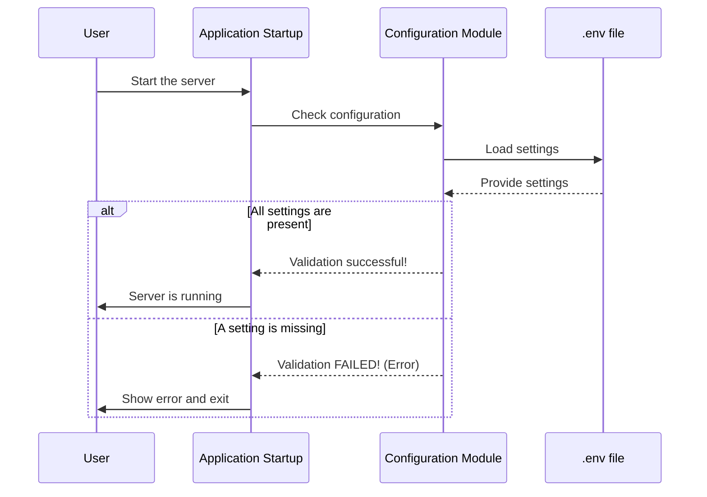

# Chapter 1: System Configuration

Welcome to the `rag-sys` tutorial! We're about to dive into the different parts of our intelligent document assistant. The very first stop on our journey is the foundation upon which everything else is built: **System Configuration**.

### The Problem: A Recipe Without an Ingredient List

Imagine you want to bake a delicious cake. You start mixing flour and sugar, but halfway through, you realize you don't have any eggs or milk. The process grinds to a halt, and you're left with a mess.

An application like `rag-sys` is similar. To work correctly, it needs several key "ingredients":
- A secret key to talk to the Azure OpenAI service (the AI's brain).
- The web address and an API key for our Qdrant database (the AI's memory).
- Names of the specific AI models we want to use.

If the application starts without one of these, it will inevitably fail later, probably right when a user tries to ask a question. This is a frustrating experience. The System Configuration is our solution to this problem. It acts as our recipe's ingredient list, ensuring we have everything we need *before* we start "baking".

### What is System Configuration?

The System Configuration is a central place that manages all the settings, secrets, and parameters our application needs to run. It's responsible for three main jobs:

1.  **Centralizing Settings:** It gathers all external settings into one predictable place.
2.  **Loading Securely:** It loads these settings (especially secrets like API keys) from a special, private file, keeping them out of our main codebase.
3.  **Validating on Startup:** It checks that all *critical* settings are present the moment the application starts. If something is missing, it stops immediately with a clear error message. This is a "fail-fast" approach, which saves us from debugging mysterious errors later.

### How We Configure `rag-sys`

In our project, the configuration "ingredient list" lives in a file you created during setup called `.env`. This file is intentionally simple and acts as your personal, secret notepad for the project.

Let's look at a piece of it from the setup instructions:

```env
# Qdrant Configuration
QDRANT_URL="<your-qdrant-cloud-url>"
QDRANT_API_KEY="<your-qdrant-api-key>"

# Azure OpenAI Configuration
AZURE_OPENAI_ENDPOINT="<your-azure-openai-endpoint>"
AZURE_OPENAI_API_KEY="<your-azure-openai-api-key>"
```

This file tells our application how to connect to the two most important external services:
- **Qdrant:** Our vector database where document information is stored.
- **Azure OpenAI:** The service that provides the powerful language models for understanding and generation.

Because this file contains secrets, it's listed in a special file called `.gitignore`, which tells Git (our version control system) to *never* share it publicly.

### Under the Hood: The Configuration Checker

So, how does the application read this file and check if everything is there? The logic for this lives in `backend/config.py`. Think of this file as our diligent "head chef" who checks the pantry (`.env` file) before starting to cook.

#### 1. The Checklist

First, our "head chef" has a checklist of ingredients that are absolutely mandatory.

```python
# file: backend/config.py

# This is our checklist of essential ingredients.
REQUIRED_ENV_VARS: List[str] = [
    "QDRANT_URL",
    "QDRANT_API_KEY",
    "AZURE_OPENAI_ENDPOINT",
    "AZURE_OPENAI_API_KEY",
    # ... and a few others
]
```
This simple list defines the bare minimum settings required for the application to function in its standard mode.

#### 2. The Validation Function

Next, there's a function that goes through this checklist and compares it against the settings it loaded from your `.env` file.

```python
# file: backend/config.py

def validate_required_env() -> None:
    """Checks if all required settings are present."""
    missing = []
    # Go through each item on our checklist
    for key in REQUIRED_ENV_VARS:
        # Check if the setting exists
        if not os.environ.get(key):
            missing.append(key)
    
    if missing:
        # If anything is missing, stop the app immediately!
        raise EnvironmentError(f"Missing required settings: {missing}")
```

This code is the heart of our "fail-fast" strategy. When you start the backend server, this `validate_required_env()` function is one of the very first things that runs.

- It loops through the `REQUIRED_ENV_VARS` checklist.
- If it can't find a setting, it adds it to a `missing` list.
- If the `missing` list isn't empty at the end, it stops the entire application and prints a helpful error telling you exactly what you need to add to your `.env` file.

This simple check prevents a whole category of runtime errors and makes setup much less painful.

### The Startup Sequence

Let's visualize how this validation step fits into the application's startup process.



As you can see, the configuration check acts as a gatekeeper. The main application can only proceed if the configuration is valid.

### A Bit of Flexibility: Handling Fallbacks

Sometimes, we want our application to be a little flexible. For instance, a setting might have been renamed from an older version of the project. Instead of forcing everyone to update their `.env` files immediately, we can make our configuration system smart enough to check for both the new and old names.

The `backend/config.py` file includes a handy helper function for this:

```python
# file: backend/config.py

def get_first_env(*names: str) -> Optional[str]:
    """Return first existing environment variable among provided names."""
    for name in names:
        value = os.environ.get(name)
        if value is not None:
            return value
    return None
```
This function is like asking, "Do we have `AZURE_OPENAI_CHAT_DEPLOYMENT_NAME`? No? Okay, how about the old `AZURE_OPENAI_GPT_DEPLOYMENT_NAME`?" It tries each name in order and returns the first one it finds. This makes our system more robust and easier for users to upgrade.

### Conclusion

You've just learned about the most fundamental part of `rag-sys`: the **System Configuration**.

- We saw that it acts like a recipe's ingredient list, ensuring all necessary settings and secrets are available.
- It centralizes these settings in a secure `.env` file, keeping them out of the main code.
- Most importantly, it validates the configuration right at startup, preventing frustrating errors later on.

With a solid configuration system in place, our application knows exactly how to connect to its essential services. Now, it's ready for the next logical step: getting some data to work with!

In the next chapter, we will explore the system responsible for reading your documents and preparing them for the AI. Let's move on to the [Data Ingestion Pipeline](02_data_ingestion_pipeline_.md).

---

Generated by [AI Codebase Knowledge Builder](https://github.com/The-Pocket/Tutorial-Codebase-Knowledge)