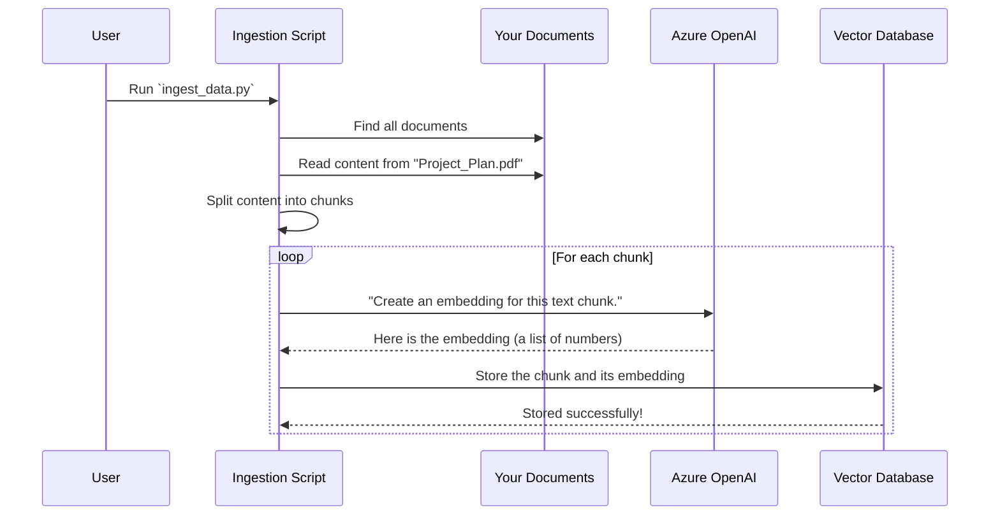

# Chapter 2: Data Ingestion Pipeline

In the [previous chapter](01_system_configuration_.md), we made sure our application had its "ingredient list" ready. It knows how to connect to its brain (Azure OpenAI) and its memory (Qdrant). But right now, that memory is completely empty!

### The Problem: A Brilliant Librarian with an Empty Library

Imagine you hire the world's best librarian. They are incredibly smart and can find any piece of information in seconds. However, you lead them to a brand new, empty library building. There are no books on the shelves. No matter how smart the librarian is, they can't answer any questions because they have nothing to reference.

Our `rag-sys` application is in the same situation. The AI is smart, but its knowledge base is empty. If you ask it a question about your project documents, it will simply say, "I don't know," because it has never seen them. The **Data Ingestion Pipeline** is the process of filling those library shelves.

### What is the Data Ingestion Pipeline?

The Data Ingestion Pipeline is our system's automated librarian. Its job is to take all your raw documents (the "books"), process them into a format the AI can understand, and file them away neatly in the vector database (the "smart catalog").

This process follows a few key steps, much like a real librarian would:

1.  **Discover:** It scans your project's `Data` folder to find all the new or updated books (PDFs, DOCX files, etc.).
2.  **Read & Split:** It opens each document and reads its contents. Since an entire book is too much to remember at once, it breaks the text down into smaller, meaningful paragraphs or "chunks."
3.  **Summarize & Index:** For each chunk, it asks the Azure OpenAI model to create a special numerical summary called an **embedding**. Think of this embedding as a super-detailed index card that captures the *meaning* of the paragraph, not just its words.
4.  **Store:** It takes each chunk of text and its corresponding embedding (the index card) and stores them together in our Qdrant vector database.

Once this is done, our AI has a fully indexed library it can search through to find answers.

### Running the Ingestion Process

In `rag-sys`, this entire process is handled by a dedicated script. You don't need to run it every time you start the application, only when you add new documents or want to update the AI's knowledge base.

You can kick off the process by running a single command in your terminal:

```bash
python scripts/ingest_data.py
```

When you run this, you'll see a log in your terminal showing the script discovering your files, processing them, and indexing them. It's like watching the librarian at work!

**Example Output:**

```text
INFO: 🚀 Data Ingestion Processor initialized
INFO: 🔍 Starting document scan...
INFO: 📊 Found 13 supported documents...
INFO: 📁 Found 13 files to index
INFO: 📚 Processing 13 documents...
INFO: [1/13] Processing: HEA 01 audit secotherm page 55-1708072.pdf
INFO: ✅ Indexed 411 chunks from HEA 01 audit secotherm page 55-1708072.pdf
INFO: [2/13] Processing: HEA 01_Daylighting Boulevard Haussman.xlsx
INFO: ✅ Indexed 6 chunks from HEA 01_Daylighting Boulevard Haussman.xlsx
...
INFO: 🎉 Completed! Processed 13 files, indexed 423 total chunks.
```
This output tells you that the script found 13 documents, broke them down into a total of 423 chunks, and successfully stored them in the AI's memory.

### Under the Hood: The Librarian's Workflow

Let's look at the step-by-step journey of a single document as it goes through the pipeline.



This diagram shows the flow: the script finds your files, breaks them into chunks, and then for each chunk, it gets a numerical "summary" (embedding) from OpenAI before storing everything in the Qdrant database.

Now, let's peek at the code in `scripts/ingest_data.py` that makes this happen.

#### Step 1: Discovering the Documents

First, the script needs to find all the files it should process. It does this by "walking" through your data directory.

```python
# A simplified view from scripts/ingest_data.py

# A list of file types we know how to read.
SUPPORTED_EXTENSIONS = [".pdf", ".docx", ".txt", ".xlsx"]
all_fs_files = set()

# Go through every folder and file in the data path.
for root, _, files in os.walk(self.data_path):
    for file in files:
        # Check if it's a file type we support.
        if Path(file).suffix.lower() in SUPPORTED_EXTENSIONS:
            all_fs_files.add(os.path.join(root, file))
```
This code searches your `Data` folder and makes a list of all the documents it can read, ignoring files it doesn't understand (like images).

#### Step 2: Reading the Pages (Loading)

Once it has a file, it needs to open and read it. Since a PDF is very different from an Excel file, we use special "loaders" for each type.

```python
# A simplified view from scripts/ingest_data.py

def _get_loader(self, file_path: str):
    """Get the appropriate document loader for the file type."""
    ext = Path(file_path).suffix.lower()
    
    if ext == ".pdf":
        return UnstructuredPDFLoader(file_path) # Use the PDF reader
    elif ext == ".docx":
        return Docx2txtLoader(file_path) # Use the Word doc reader
    elif ext == ".xlsx":
        return UnstructuredExcelLoader(file_path) # Use the Excel reader
    # ... and so on for other types
```
This helper function acts like a specialist, choosing the right tool to extract text from each kind of document.

#### Step 3: Finding Key Paragraphs (Chunking)

A 50-page document is too long for an AI to consider all at once. We need to break it into smaller, overlapping chunks. This ensures we don't lose the context between the end of one chunk and the beginning of the next.

```python
# A simplified view from scripts/ingest_data.py

# Set up our text splitter.
self.text_splitter = RecursiveCharacterTextSplitter(
    chunk_size=1200,    # Aim for chunks of this many characters
    chunk_overlap=250   # Overlap chunks by this many characters
)

# Use the splitter on the loaded documents.
chunks = self.text_splitter.split_documents(documents)
```
This code defines our strategy for breaking down text. It creates chunks of about 1200 characters, but each chunk shares 250 characters with the one before it, like overlapping shingles on a roof.

#### Step 4 & 5: Creating Index Cards (Embedding) and Storing Them

This is where the magic happens. For each chunk of text, we ask the AI to create an embedding and then we store both the text and the embedding in our Qdrant database.

```python
# A simplified view from scripts/ingest_data.py

points = []
for chunk in chunks:
    # 1. Ask the AI to create the numerical representation.
    embedding = self._create_embedding(chunk.page_content)
    
    # 2. Prepare the data packet for Qdrant.
    point = models.PointStruct(
        id=str(uuid.uuid4()),      # A unique ID for this chunk
        vector=embedding,          # The numerical embedding
        payload={"content": chunk.page_content, "file_name": ...}
    )
    points.append(point)

# 3. Send all the new points to Qdrant in one batch.
self.qdrant_client.upsert(
    collection_name=COLLECTION_NAME,
    points=points
)
```
The `payload` is crucial—it's the human-readable content and metadata (like the original filename) that we store alongside the numerical `vector`. This way, when we find a matching vector later, we can also retrieve the original text to show the user. This is a core part of the [RAG Service (Core Logic)](05_rag_service__core_logic_.md).

### Being Smart About Updates: The Cache

Running this entire process can take time, especially if you have thousands of documents. It would be very inefficient to re-process every single file each time you run the script.

To solve this, our ingestion script uses a cache. It's a small record-keeping file (`scripts/.indexing_cache.json`) that remembers which files it has already processed and when they were last modified.

The next time you run `ingest_data.py`, it first checks this cache:
- "Is this file new? If yes, I'll process it."
- "Has this file been modified since the last time I saw it? If yes, I'll re-process it."
- "Is this file unchanged? If yes, I'll skip it."

This makes the process incredibly fast for day-to-day updates, as it only focuses on what's new or different.

### Conclusion

You've just learned how `rag-sys` fills its library. The **Data Ingestion Pipeline** is the powerful process that turns your static collection of documents into a living, searchable knowledge base for the AI.

- We saw how it **discovers**, **loads**, **chunks**, **embeds**, and **stores** your document data.
- We walked through the script that automates this entire workflow.
- We learned how a cache makes the update process fast and efficient.

Now that our AI's memory is filled with knowledge, we need a way for users to ask questions. In the next chapter, we'll build the user interface for our chat assistant.

Let's move on to the [Frontend Application](03_frontend_application_.md).

---

Generated by [AI Codebase Knowledge Builder](https://github.com/The-Pocket/Tutorial-Codebase-Knowledge)