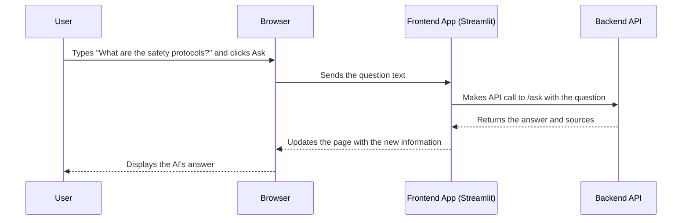

# Chapter 3: Frontend Application

In the [previous chapter](02_data_ingestion_pipeline_.md), we acted as a librarian, carefully processing our documents and stocking the shelves of our AI's memory. Our system is now full of knowledge, but there's a problem: nobody can talk to it yet.

### The Problem: A Brilliant Librarian with No Front Desk

Imagine our knowledgeable librarian is ready to answer questions, but the library has no front desk, no phone, and no email. Patrons can't ask their questions, and the librarian's knowledge remains locked away. Our `rag-sys` project is in the same state. The AI is ready, but users have no way to interact with it.

The **Frontend Application** is the solution. It's the "front desk" of our library—the web page you see and interact with in your browser. It provides the chat window and search tools that connect you, the user, to the powerful AI in the background.

### What is the Frontend Application?

The Frontend Application is the user-facing part of our project. Think of it like the cockpit of an airplane. It gives you all the controls (the chat box, search filters, buttons) and displays (the AI's answer, source documents, analytics) you need to "fly" the system, without you needing to understand the complex mechanics of the jet engines (the backend).

Its primary jobs are:
1.  **Provide an Interface:** Display a friendly chat window.
2.  **Capture Your Input:** Take the question you type into the text box.
3.  **Communicate with the Backend:** Send your question over the network to our backend server.
4.  **Display the Response:** Receive the answer from the backend and present it in a clean, readable format.

In `rag-sys`, we use a popular Python library called **Streamlit** to build this interface. Streamlit is fantastic for beginners because it lets us create interactive web pages using only Python code, without needing to learn complex web technologies like HTML or JavaScript.

### How to Run the Frontend

As you saw in the setup guide, you can start the entire user interface with a single command in your terminal:

```bash
streamlit run frontend/streamlit_app.py
```

This command tells Streamlit to run our main frontend file, `streamlit_app.py`. It automatically starts a local web server and opens a new tab in your browser, showing you the RAG Document Assistant.

### Under the Hood: A User Asks a Question

Let's trace the journey of a single question, from the moment you type it until you see the answer.

1.  **You type a question** into the chat box in your browser and click "Ask".
2.  The **Frontend Application** (our Streamlit code) grabs that text.
3.  It packages your question into a standard web request (an "API call").
4.  It sends this request to a specific web address on our backend server, for example, `http://localhost:8000/ask`.
5.  The frontend then waits patiently for a response.
6.  The backend does its magic (which we'll cover in the next chapters) and sends back a response containing the answer and the sources it used.
7.  The frontend receives this response, unpacks it, and updates the web page to display the answer and source documents to you.

Here’s a simple diagram of that flow:



### Peeking at the Code: `frontend/streamlit_app.py`

Let's look at some simplified snippets from `frontend/streamlit_app.py` to see how Streamlit makes this process so easy.

#### 1. Creating the User Interface

Building the chat input box is surprisingly simple with Streamlit.

```python
# file: frontend/streamlit_app.py
import streamlit as st

# This one line creates the text area for the user's question.
question = st.text_area("💬 Enter your question:")

# This creates a button. The code inside the `if` block
# only runs when the user clicks it.
if st.button("🔍 Ask Question"):
    # ... logic to handle the question goes here ...
    st.write("You asked: ", question)
```

Every `st.` command in Streamlit adds an element to your web page. `st.text_area()` creates the input box, and `st.button()` creates the button. It feels more like writing a simple script than building a complex website.

#### 2. Sending the Question to the Backend

When the user clicks the "Ask Question" button, we need to send their question to the backend. This is done inside a helper function, which acts as our messenger.

```python
# file: frontend/streamlit_app.py
import requests # A library for making web requests

def ask_question(backend_url: str, question: str):
    """Sends the user's question to the backend API."""
    api_endpoint = f"{backend_url}/ask"
    payload = {"question": question}
    
    # Send the question and get the response
    response = requests.post(api_endpoint, json=payload)
    return response.json()
```

This function is like mailing a letter.
- `api_endpoint` is the address of our backend's "inbox."
- `payload` is the content of the letter (your question).
- `requests.post(...)` is the act of sending it.
- `response.json()` is opening the reply letter and reading its contents.

#### 3. Displaying the Answer

Finally, we connect these two pieces. When the button is clicked, we call our messenger function and then display the result.

```python
# file: frontend/streamlit_app.py

if st.button("🔍 Ask Question"):
    # Show a "thinking..." message while we wait
    with st.spinner("🤔 Analyzing documents..."):
        result = ask_question(backend_url, question)

    # Display the answer from the backend
    st.markdown(result.get("answer"))
    
    # Display the sources in a collapsible section
    with st.expander("📚 Sources"):
        for source in result.get("sources", []):
            st.success(source.get("file_name"))
```

Here, `st.spinner()` provides a nice loading animation, so the user knows the system is working. `st.markdown()` displays the AI's answer, and `st.expander()` creates a neat, clickable section to show the list of source documents.

Notice that the frontend has no idea *how* the answer was generated. It doesn't know about embeddings, vector databases, or AI models. It only knows how to send a question to the `/ask` endpoint and how to display the answer it gets back. This separation makes our system clean and easy to manage. The frontend worries about looking good, while the backend worries about being smart.

### Conclusion

You've just learned about the user's window into our system: the **Frontend Application**.

-   We saw that it provides the user interface that you interact with in the browser.
-   It's built with Streamlit, which makes creating web apps in Python simple.
-   Its main job is to capture user input, send it to the backend via an API call, and display the result in a friendly way.

The frontend acts as a client, making requests to our backend server. Now, let's step behind the counter and look at the system that receives these requests.

In the next chapter, we'll explore the [API Layer](04_api_layer_.md), the official "front door" to our backend's logic.

---

Generated by [AI Codebase Knowledge Builder](https://github.com/The-Pocket/Tutorial-Codebase-Knowledge)