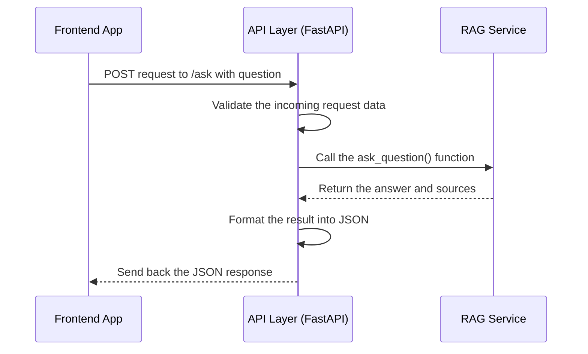

# Chapter 4: API Layer

In the [previous chapter](03_frontend_application_.md), we built our system's "front desk"—the user interface where you can type in a question. We saw how the frontend application packages that question and sends it to the backend. But who at the backend receives this message?

### The Problem: A Library with No Front Door

Imagine our library has a friendly librarian (the Frontend) and a vast, organized collection of books (the Data). But the library building itself has no doors or windows. No matter how many messages the librarian sends, they just bounce off the brick walls. There's no official entry point to receive requests and direct them to the right place.

Our backend needs a formal, well-defined "front door" for the frontend to communicate with. This entry point is the **API Layer**.

### What is the API Layer?

The API (Application Programming Interface) Layer is the official entry point for our backend. It's like the front desk of a hotel. When a guest (the frontend) arrives, they don't just wander into the kitchen or a random hotel room. They go to the front desk, which handles all their requests.

The API Layer's jobs are:

1.  **Define Entry Points:** It creates specific web addresses, called **endpoints** (like `/ask` or `/search`), that the frontend knows how to call.
2.  **Receive Requests:** It listens for incoming requests from the frontend at these endpoints.
3.  **Validate the Request:** It checks if the request is formatted correctly. For example, a request to `/ask` must actually contain a question.
4.  **Route to the Correct Service:** It acts as a traffic controller, passing the request to the correct internal department. A request to `/ask` goes to our main AI brain, the [RAG Service (Core Logic)](05_rag_service__core_logic__.md).
5.  **Return a Formatted Response:** Once the internal service has an answer, the API Layer packages it into a standard format (usually JSON) and sends it back to the frontend.

In `rag-sys`, we use a modern Python framework called **FastAPI** to build our API Layer. FastAPI is excellent for beginners because it's fast, easy to use, and helps prevent common errors.

### Under the Hood: Tracing a Request Through the API

Let's follow a user's question as it arrives at the backend and is handled by the API Layer.

1.  The [Frontend Application](03_frontend_application_.md) sends a request to the address `http://localhost:8000/ask`.
2.  Our **API Layer** (running via FastAPI) is listening. It sees the `/ask` part and knows which function to run.
3.  It checks the incoming data to make sure it contains a `question`.
4.  It then calls the main logic unit, the **RAG Service**, and says, "Here is a question, please find an answer."
5.  The RAG Service does its work and returns the answer and sources.
6.  The API Layer receives this result, formats it into a neat package, and sends it back to the frontend, which can then display it.

Here's a diagram of that interaction:



As you can see, the API Layer doesn't generate the answer itself. It's a manager, a coordinator. It ensures requests are handled properly and efficiently routed to the expert in charge.

### Peeking at the Code: `backend/main.py`

All the logic for our API Layer lives in `backend/main.py`. Let's look at how FastAPI makes creating this "front door" so simple.

#### 1. Creating the Application

First, we create our FastAPI application. This one line is all it takes to get started.

```python
# file: backend/main.py
from fastapi import FastAPI

# This one line creates our main API application
app = FastAPI(title="RAG Document Assistant API")
```
This `app` object is now our central controller. We'll attach all our endpoints to it.

#### 2. Defining the `/ask` Endpoint

This is the most important part. We need to create the `/ask` endpoint that our frontend calls. In FastAPI, we do this with something called a **decorator**. Think of a decorator (`@app.post(...)`) as a sticky note you put on a function to give it special powers.

```python
# file: backend/main.py
from backend.models import QuestionRequest, RAGResponse

# This "decorator" creates the /ask endpoint.
@app.post("/ask", response_model=RAGResponse)
def ask_question(request: QuestionRequest):
    # ... function code goes here ...
```
This little block of code does a lot:
-   `@app.post("/ask")`: This sticky note tells FastAPI: "Anytime you get a `POST` web request at the `/ask` address, run the function below."
-   `request: QuestionRequest`: This is a data contract. It tells FastAPI, "The data coming in *must* look like a `QuestionRequest`." This is a powerful feature that automatically validates incoming data. We'll see more on this in the [Data Models](07_data_models_.md) chapter.
-   `response_model=RAGResponse`: This tells FastAPI, "The data I send back *will* look like a `RAGResponse`." This helps with documentation and error checking.

#### 3. Handling the Request

Now, let's look inside the function. The code is very clean because the API Layer's only job is to delegate.

```python
# file: backend/main.py

@app.post("/ask", response_model=RAGResponse)
def ask_question(request: QuestionRequest):
    # 1. Get our main logic unit, the RAG service.
    rag_service: AdvancedRAGService = app_state["rag_service"]
    
    # 2. Pass the user's request to the service.
    response = rag_service.ask_question(request)
    
    # 3. Return the result. FastAPI handles converting it to JSON!
    return response
```
This code follows our front desk analogy perfectly:
1.  **Get the Right Department:** It looks up the `rag_service` (our AI expert).
2.  **Delegate the Task:** It calls the `ask_question` method on that service, handing over the user's request.
3.  **Return the Answer:** It simply returns the result. FastAPI takes care of the boring work of converting the Python object into JSON and sending it back over the network.

This separation of concerns is critical. The API Layer (`main.py`) worries about web traffic, validation, and routing. The [RAG Service (Core Logic)](05_rag_service__core_logic_.md) worries about the complex task of finding and generating answers.

### Running the API Server

As you learned during setup, you run this entire backend API with a single command:

```bash
uvicorn backend.main:app --host 0.0.0.0 --port 8000
```

This command tells a web server program named `uvicorn` to run the `app` object found inside our `backend/main.py` file. It's like opening the hotel for business and telling the front desk staff to start taking requests.

### Conclusion

You've just toured the official front door of our backend: the **API Layer**.

-   We learned that it acts as the primary entry point, like a hotel's front desk.
-   It's built using **FastAPI**, which helps us define endpoints like `/ask`.
-   Its main job is to receive requests, validate them, route them to the correct internal service, and return a formatted response.
-   This keeps our code organized, with the API Layer handling web traffic and the services handling the core logic.

Now that we've seen how a request is received by the API Layer and passed on, it's time to follow that request deeper into the system. Where does it go next? It goes to the brain of our operation.

In the next chapter, we'll explore the [RAG Service (Core Logic)](05_rag_service__core_logic_.md) and see how it actually generates an answer to the user's question.

---

Generated by [AI Codebase Knowledge Builder](https://github.com/The-Pocket/Tutorial-Codebase-Knowledge)