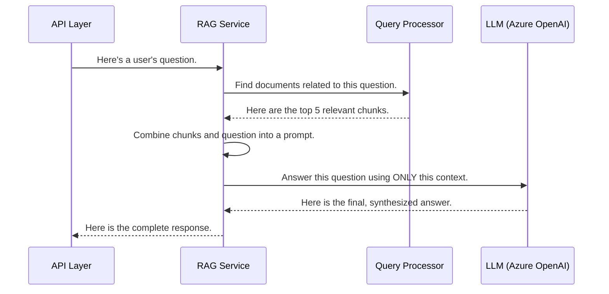

# Chapter 5: RAG Service (Core Logic)

In the [previous chapter](04_api_layer_.md), we built our backend's "front door," the API Layer. We saw how it accepts a user's question and passes it deeper into the system for processing. But who does it pass the question to? It hands it off to the brain of our entire operation: the **RAG Service**.

### The Problem: A Consultant with a Pile of Research

Imagine you're an expert consultant hired to answer a critical question for a client. Your research assistant runs to the library and comes back with a stack of relevant books and articles. Now what?

You can't just hand the entire pile of raw research to the client. That would be overwhelming and unhelpful. Your job is to:
1.  Read through the research materials.
2.  Synthesize the key information that directly answers the client's question.
3.  Write a final, coherent report in clear language.

The **RAG Service** is this expert consultant. The [API Layer](04_api_layer_.md) gives it the client's question. It then gets the "research materials" (relevant document chunks) and performs the crucial step of turning them into a final answer.

### What is the RAG Service?

The RAG Service is the core component that combines the two key parts of our system's name: **Retrieval-Augmented Generation**.

1.  **Retrieval:** It first *retrieves* the most relevant pieces of information from our document library (the vector database).
2.  **Generation:** It then uses this information to *generate* a new, human-like answer.

It acts as the central coordinator for answering a question. It takes the user's query, fetches the necessary context, and then carefully instructs a powerful Large Language Model (LLM) like GPT-4 to formulate a final response. This ensures the AI's answer isn't just a random guess from its general knowledge, but is specifically based on *your* documents.

### Under the Hood: The Consultant's Workflow

Let's trace a question as it's processed by our expert consultant, the RAG Service.

1.  The [API Layer](04_api_layer_.md) passes the user's question, "What are the building's energy targets?", to the RAG Service.
2.  The RAG Service turns to its research assistant, the [Query Processor (Retrieval Engine)](06_query_processor__retrieval_engine__.md), and asks it to find the most relevant document chunks for this question.
3.  The Query Processor searches the vector database and returns a few key paragraphs about energy efficiency and consumption limits.
4.  The RAG Service now takes these paragraphs (the "context") and writes a very specific set of instructions (a "prompt") for the LLM. The prompt might look something like this:
    > "You are an expert consultant. Based ONLY on the following information, answer the user's question. Context: [paragraph 1], [paragraph 2]... Question: What are the building's energy targets?"
5.  It sends this detailed prompt to the LLM (Azure OpenAI).
6.  The LLM reads the instructions and context, and writes back a final, synthesized answer: "The building's energy target is to maintain a consumption rate below 120 kWh/m²/year, as specified in the HEA 01 audit document."
7.  The RAG Service packages this answer and the source documents it used, and returns them to the API Layer.

Here is a diagram of this workflow:



### Peeking at the Code: `backend/enhanced_rag_service.py`

The logic for our consultant lives in `backend/enhanced_rag_service.py`. Let's look at a simplified version of the main `ask_question` function to see how these steps translate to code.

#### Step 1: Retrieval (The "R" in RAG)

The first step is to get the research materials. The RAG Service calls the document processor (our [Query Processor (Retrieval Engine)](06_query_processor__retrieval_engine__.md)) to find relevant text chunks.

```python
# file: backend/enhanced_rag_service.py

# 1. Find relevant document chunks.
search_results = self.doc_processor.similarity_search(
    request.question, limit=6
)
```
This line is the "Retrieval" step. It asks our document search system to find the top 6 most relevant chunks for the user's question and stores them in `search_results`.

#### Step 2: Consolidating the Context

Next, we take all those individual text chunks and package them neatly into a single block of text called the "context".

```python
# file: backend/enhanced_rag_service.py

# 2. Package the document chunks into a single "context".
context_data = self.context_processor.consolidate_context(
    search_results, request.question
)
consolidated_context = context_data['consolidated_text']
```
This is like our consultant organizing the messy pile of research into a tidy, easy-to-read briefing document.

#### Step 3: Crafting the Perfect Instructions (The Prompt)

This is the most important step. We create a set of instructions for the LLM, called a **prompt**. The prompt template tells the AI exactly what its role is, what information it's allowed to use, and what question it needs to answer.

```python
# A simplified example of our prompt template

prompt_template = """
You are an expert building consultant analyzing building evaluation documents.
Provide a comprehensive answer based solely on the provided context.

Context Information:
{context}

---

Question: {question}
"""
```
This template has placeholders (`{context}` and `{question}`) that we will fill in. The instruction "based solely on the provided context" is critical—it's what keeps the AI's answer grounded in the facts from your documents.

#### Step 4: Generation (The "G" in RAG)

Finally, we fill in the prompt template with our consolidated context and the user's question, and send it to the LLM to get the final answer.

```python
# file: backend/enhanced_rag_service.py

# 3. Create the prompt from the template.
prompt = ChatPromptTemplate.from_template(prompt_template)

# 4. Send the prompt to the AI to get the final answer.
response = self.llm.invoke(prompt.format(
    context=consolidated_context,
    question=request.question
))
answer = response.content
```
The `self.llm.invoke(...)` call is the moment of "Generation." The powerful AI model processes our entire prompt and generates a new, coherent answer, which we capture in the `answer` variable.

### Conclusion

You have now met the brain of `rag-sys`: the **RAG Service**.

-   We learned that it acts as the central coordinator, like an expert consultant.
-   It performs the two key steps: **Retrieval** (finding documents) and **Generation** (creating an answer).
-   It uses a carefully crafted **prompt** to instruct a powerful LLM to answer questions based *only* on the information found in your documents.

The RAG Service relies on its "research assistant" to do a good job of finding the right documents in the first place. If the assistant brings back irrelevant information, the final report won't be very good. So, how does that retrieval process actually work?

In the next chapter, we will dive into the mechanics of that research assistant. Let's explore the [Query Processor (Retrieval Engine)](06_query_processor__retrieval_engine__.md).

---

Generated by [AI Codebase Knowledge Builder](https://github.com/The-Pocket/Tutorial-Codebase-Knowledge)