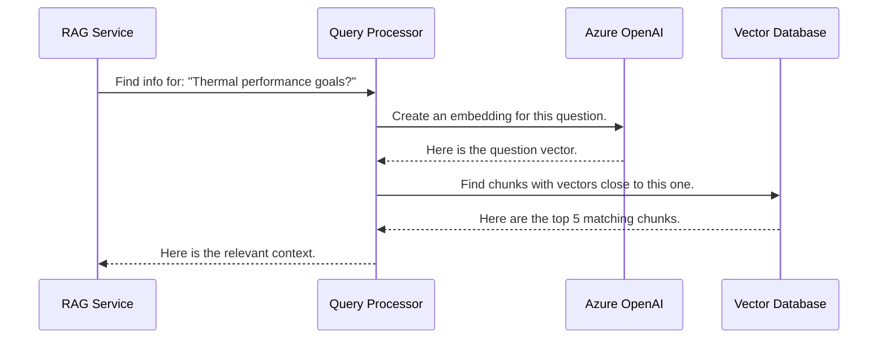

# Chapter 6: Query Processor (Retrieval Engine)

In the [previous chapter](05_rag_service__core_logic_.md), we met the expert consultant of our system, the **RAG Service**. We saw how it takes a user's question, combines it with relevant research, and instructs an AI to write a final answer. But we glossed over a critical step: how does it get that "relevant research" in the first place?

### The Problem: A Consultant with a Clumsy Assistant

Imagine our expert consultant needs to find information about a building's energy targets. They send their research assistant to the library with the request.

If the assistant is clumsy, they might just run a simple keyword search for "energy targets." They might miss a crucial paragraph in a document that says, "The goal for thermal performance is..." This paragraph is exactly what the consultant needs, but because it didn't use the exact words "energy targets," the assistant missed it completely.

The quality of the final answer depends entirely on the quality of the research provided. We need an assistant who is much smarter than a simple keyword search. This assistant is our **Query Processor**.

### What is the Query Processor?

The Query Processor is our system's expert research assistant. Its one and only job is to find the most relevant document chunks from our vector database (Qdrant) to answer a specific question. It is the "Retrieval" engine in **Retrieval-Augmented Generation**.

Think of it as a super-powered librarian. When you ask it a question, it doesn't just look for matching words. It understands the *meaning* or *semantic intent* behind your question and finds paragraphs that are conceptually similar.

-   A **keyword search** looks for "car." It will miss documents that only mention "automobile" or "vehicle."
-   A **semantic search** looks for the *concept* of a car. It will find documents that mention "car," "automobile," "vehicle," "sedan," and "electric SUV" because it understands they are all related.

This ability to search by meaning is what makes our system so powerful.

### Under the Hood: The Semantic Search Workflow

So how does this magic work? Let's follow a question as it's handled by the Query Processor.

1.  The [RAG Service (Core Logic)](05_rag_service__core_logic_.md) asks, "Find documents related to: *'What are the building's thermal performance goals?'*"
2.  The Query Processor takes this question and first sends it to the Azure OpenAI embedding model. It asks, "Please turn this sentence into a numerical 'meaning' vector (an embedding)."
3.  The AI model returns a long list of numbers, like `[0.02, -0.45, 0.81, ...]`, which represents the mathematical meaning of the question.
4.  The Query Processor then takes this "question vector" and sends it to our Qdrant vector database. It says, "Search your entire collection and find the document chunks whose own vectors are the most mathematically similar to this one."
5.  Qdrant performs this high-speed comparison across thousands of stored chunks and returns the top 5 or 6 that are the "closest" matches in meaning.
6.  These matching chunks (the relevant research) are then sent back to the RAG Service.

Here is a diagram of that process:



### Peeking at the Code: `backend/enhanced_query_processor.py`

The logic for our expert research assistant lives in `backend/enhanced_query_processor.py`. Let's look at a simplified version to see how the steps above are implemented.

#### Step 1: Connecting to the Tools

First, our Query Processor needs to know how to talk to its two key resources: the AI model for creating embeddings and the Qdrant database for searching.

```python
# file: backend/enhanced_query_processor.py

class EnhancedQdrantQueryProcessor:
    def __init__(self):
        # Connect to our vector database
        self.qdrant_client = QdrantClient(...) 

        # Connect to the AI model that creates embeddings
        self.embeddings = AzureOpenAIEmbeddings(...)
        
        logger.info("✅ Query Processor is ready to search!")
```
This initialization code runs when the application starts, ensuring our assistant is connected and ready to receive requests.

#### Step 2: Understanding the Question (Creating an Embedding)

When a new question comes in, the first step is to convert it into a vector.

```python
# file: backend/enhanced_query_processor.py

def _create_embedding(self, text: str):
    """Turns a text question into a numerical representation."""
    
    # Ask the AI model to create a 'meaning vector' for the user's question.
    return self.embeddings.embed_query(text)
```
This small function takes the user's question (e.g., "What are the building's thermal performance goals?") and returns that magical list of numbers that captures its semantic meaning.

#### Step 3: Searching the Library (Querying Qdrant)

With the question vector in hand, we can now search our database.

```python
# file: backend/enhanced_query_processor.py

def semantic_search(self, query: str, limit: int = 6):
    # 1. Turn the user's question into a vector.
    query_embedding = self._create_embedding(query)
    
    # 2. Search the database for the most similar vectors.
    search_results = self.qdrant_client.search(
        collection_name=COLLECTION_NAME,
        query_vector=query_embedding,
        limit=limit,
        with_payload=True # Also get the original text
    )
    return search_results
```
This is the core of the entire retrieval process.
- We first call our `_create_embedding` helper to get the vector for the `query`.
- We then use the `qdrant_client.search` method, giving it our question vector.
- Qdrant does the heavy lifting of comparing this vector against all the vectors in our collection.
- `with_payload=True` is crucial. It tells Qdrant, "Don't just give me the matching vectors; give me the original text and metadata associated with them!" This is how we get the actual document content back.

### The Power of Semantic Search in Action

Let's revisit our earlier example to see why this is so much better than a keyword search.

-   **User's Question:** "What are the building's thermal performance goals?"
-   **A chunk in a document:** "The structure is required to maintain an energy consumption rate below 120 kWh/m²/year."

These two sentences share very few keywords ("building's" vs "structure"). A simple keyword search would likely fail to see a connection.

However, the AI embedding model understands that "thermal performance goals" and "energy consumption rate" are deeply related concepts in the context of building design. It will therefore create vectors for these two sentences that are very "close" to each other in mathematical space. When our Query Processor searches with the question's vector, this document chunk will be returned as a highly relevant result. This is the magic that unlocks the true knowledge hidden in your documents.

### Conclusion

You've just been introduced to the powerhouse of our RAG system's "retrieval" capabilities: the **Query Processor**.

-   We learned it acts as an expert research assistant, finding document chunks based on **meaning (semantics)**, not just keywords.
-   We walked through its process: create an **embedding** for the user's question, and then use that embedding to search the **vector database** for the most similar document chunks.
-   We saw how this "semantic search" can find relevant information that traditional search methods would miss.

With this component, the [RAG Service (Core Logic)](05_rag_service__core_logic_.md) is guaranteed to receive high-quality, relevant context, enabling it to generate accurate and helpful answers.

We've now seen all the major services and logical components of `rag-sys`. But how do they ensure they're all speaking the same language when they pass data to each other? That's where our final chapter comes in.

Let's explore the structured "data contracts" that hold our system together in [Data Models](07_data_models_.md).

---

Generated by [AI Codebase Knowledge Builder](https://github.com/The-Pocket/Tutorial-Codebase-Knowledge)