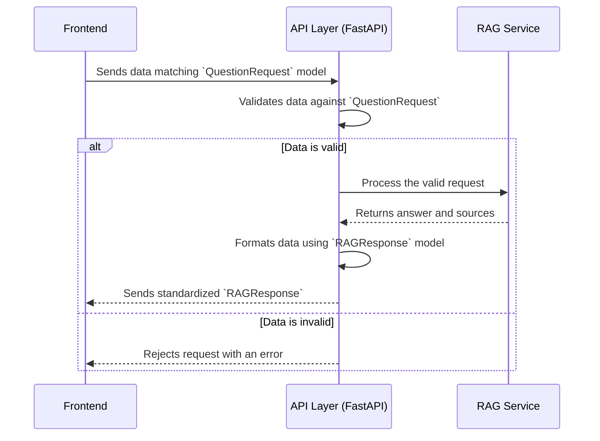

# Chapter 7: Data Models

In the [previous chapter](06_query_processor__retrieval_engine_.md), we explored the powerful research assistant of our system, the **Query Processor**. We've now seen every major functional component of `rag-sys`, from the user interface all the way down to the database search.

But how do all these different parts talk to each other without misunderstanding?

### The Problem: A Confusing Shipping Operation

Imagine you run a global shipping company.
- Your warehouse in Paris packs items into square boxes and labels them "Colis."
- Your receiving center in Tokyo is expecting round boxes with labels that say "荷物" (Nimotsu).

When the shipment arrives, chaos ensues. The Tokyo team doesn't know how to handle the square boxes, and they can't read the labels. The entire process grinds to a halt because the sender and receiver didn't agree on a standard format.

Our application faces the same risk. The [Frontend Application](03_frontend_application_.md) needs to send a question to the [API Layer](04_api_layer_.md). If the frontend sends data in a format the backend doesn't expect, the system will break.

### What are Data Models?

**Data Models** are the solution. They are the strict, agreed-upon blueprints for data moving through our system. They act as a contract between the sender and the receiver.

Think of them as standardized shipping labels and container specifications in our logistics analogy. They guarantee that every package of data is clearly defined, so the frontend and backend know exactly what to expect.

In our project, we use a library called **Pydantic** to create these data models. Pydantic lets us define the "shape" of our data using simple Python classes.

The key jobs of our Data Models are:
1.  **Defining Structure:** Clearly state what fields data should have (e.g., a question must have a `question` field which is a string).
2.  **Enforcing Rules (Validation):** Automatically check if incoming data matches the blueprint. If not, it rejects the data with a clear error.
3.  **Providing Clarity (Documentation):** Anyone reading the code can immediately understand the format of data being passed around.

### Under the Hood: A Data Contract in Action

Let's see how these "data contracts" are used when you ask a question.

1.  The [Frontend Application](03_frontend_application_.md) prepares to send your question. It looks at the "contract" for sending a question (our `QuestionRequest` model) and builds a data packet that matches it perfectly.
2.  It sends this packet to the `/ask` endpoint on our [API Layer](04_api_layer_.md).
3.  FastAPI, our API framework, acts as the quality inspector. It automatically compares the incoming packet to the `QuestionRequest` blueprint.
    -   If it matches, the request is allowed through.
    -   If it doesn't match (e.g., a field is missing), FastAPI immediately rejects it and sends back an error.
4.  After the [RAG Service (Core Logic)](05_rag_service__core_logic_.md) generates an answer, the API Layer prepares the response. It uses another "contract" (our `RAGResponse` model) to package the answer and sources into a standard format before sending it back.
5.  The frontend receives this response and, because it knows the `RAGResponse` format, it can confidently unpack and display the information.

Here is a diagram of this flow, showing the data models as gatekeepers.



### Peeking at the Code: `backend/models.py`

All of our data blueprints live in the `backend/models.py` file. Let's look at simplified versions of our two most important models.

#### 1. The Blueprint for a Question: `QuestionRequest`

This model defines the contract for any request coming *into* the `/ask` endpoint. It's incredibly simple: the request must contain a single field named `question` that holds a string.

```python
# file: backend/models.py
from pydantic import BaseModel

class QuestionRequest(BaseModel):
    question: str
```

This tiny class is very powerful. When we use it in our API, FastAPI will automatically enforce this rule.

Now, let's see how it's used in the [API Layer](04_api_layer_.md).

```python
# file: backend/main.py

# FastAPI uses the model here to validate incoming data
@app.post("/ask")
def ask_question(request: QuestionRequest):
    # Because of the type hint above, we are GUARANTEED
    # that request.question exists and is a string.
    question_text = request.question
    # ... process the question
```
The `request: QuestionRequest` part is the magic. It tells FastAPI, "Use the `QuestionRequest` model as a blueprint to check whatever data comes in." This prevents a whole class of errors and makes our code safe and predictable.

#### 2. The Blueprint for an Answer: `RAGResponse`

This model defines the contract for any response going *out* of the `/ask` endpoint. It specifies the exact structure of the final answer.

First, we need a small blueprint for what a single "source" document looks like.

```python
# file: backend/models.py
from pydantic import BaseModel
from typing import List

class Source(BaseModel):
    file_name: str
    content: str
```
This says that every source must have a `file_name` and some `content`, both of which are strings.

Now, we can define the main response model, which includes a list of these sources.

```python
# file: backend/models.py

class RAGResponse(BaseModel):
    answer: str
    sources: List[Source]
```
This blueprint guarantees that every response from our API will have an `answer` (a string) and a list of `sources`, where each source follows the `Source` blueprint.

Let's see how it's used in the API endpoint.

```python
# file: backend/main.py

# FastAPI uses this model to structure the outgoing data
@app.post("/ask", response_model=RAGResponse)
def ask_question(request: QuestionRequest):
    # ... logic to get the answer and sources ...
    
    final_answer = "This is the answer from the AI."
    source_docs = [Source(file_name="doc1.pdf", content="...")]

    return RAGResponse(answer=final_answer, sources=source_docs)
```
The `response_model=RAGResponse` part tells FastAPI, "The data I return from this function must conform to the `RAGResponse` blueprint." This ensures the frontend will always receive data in a consistent and predictable format, making it much easier to work with.

### Conclusion

You've just learned about the unsung heroes of our system: the **Data Models**.

-   We saw that they act as strict "data contracts" or blueprints, ensuring that different parts of our system can communicate reliably.
-   They define the exact structure of data for both incoming requests (`QuestionRequest`) and outgoing responses (`RAGResponse`).
-   They are built using **Pydantic**, and our API framework **FastAPI** uses them to automatically validate data, preventing errors and making our code robust.

By enforcing a standard format for communication, data models provide the stability and predictability that allow all the other complex parts of `rag-sys` to work together seamlessly.

This concludes our tour of the `rag-sys` project architecture. You have journeyed from the initial configuration all the way through the frontend, API, core logic, and data layers. You now have a complete, high-level understanding of how an advanced RAG system is built

---

Generated by [AI Codebase Knowledge Builder](https://github.com/The-Pocket/Tutorial-Codebase-Knowledge)