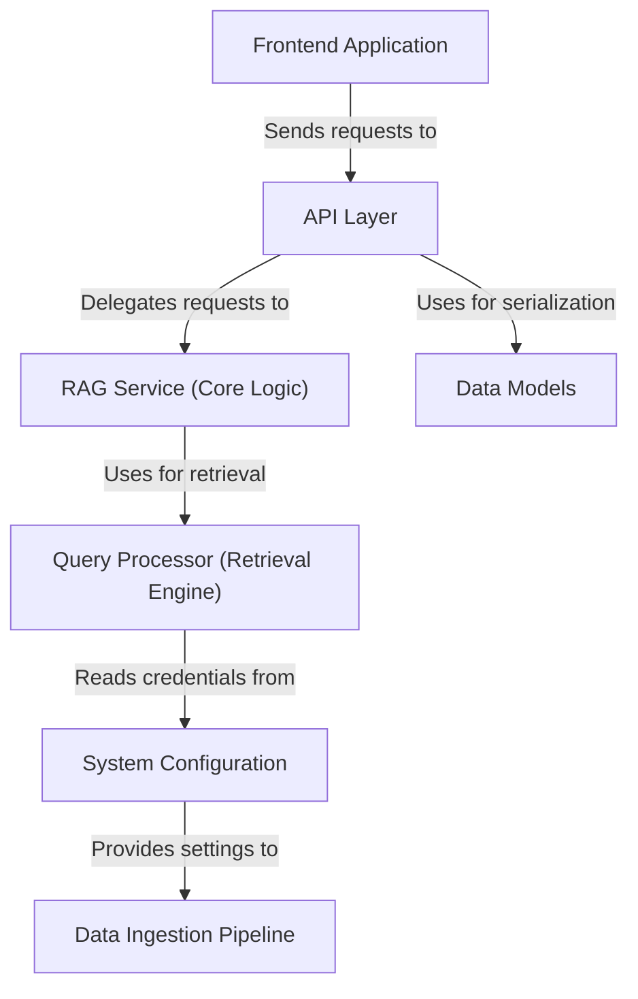

# Tutorial: rag-sys

This project is a **smart document assistant** that lets you *chat with your own files*, like PDFs and Word documents. You first run a script to process and index your documents into a specialized vector database. Afterwards, you can ask questions in plain English through a web application, and the system will find the most relevant information in your files to generate a detailed, accurate answer.

**Source Repository:** [https://github.com/mohamedamineelabidi/rag-sys.git](https://github.com/mohamedamineelabidi/rag-sys.git)

## Chapters

1. [System Configuration
](01_system_configuration_.md)
2. [Data Ingestion Pipeline
](02_data_ingestion_pipeline_.md)
3. [Frontend Application
](03_frontend_application_.md)
4. [API Layer
](04_api_layer_.md)
5. [RAG Service (Core Logic)
](05_rag_service__core_logic__.md)
6. [Query Processor (Retrieval Engine)
](06_query_processor__retrieval_engine__.md)
7. [Data Models
](07_data_models_.md)

---

Generated by [AI Codebase Knowledge Builder](https://github.com/The-Pocket/Tutorial-Codebase-Knowledge)