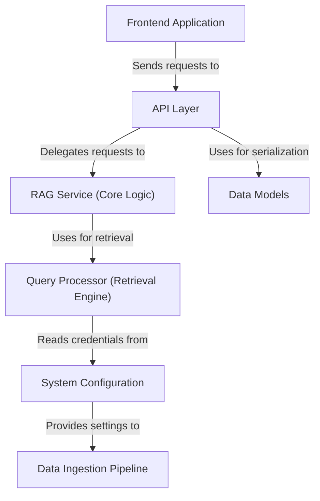

# RAG Document Assistant - Technical Documentation

Detailed documentation covering the architecture, components, and implementation of the RAG Document Assistant system.

## System Overview

This system enables intelligent question-answering over document collections using a Retrieval-Augmented Generation (RAG) pipeline. Documents are processed, embedded, and stored in a vector database. User queries trigger semantic search to retrieve relevant context, which is then used to generate accurate, grounded responses.

## Architecture Diagram

## Documentation Chapters

1. [System Configuration](01_system_configuration_.md) - Environment variables and setup
2. [Data Ingestion Pipeline](02_data_ingestion_pipeline_.md) - Document processing and indexing
3. [Frontend Application](03_frontend_application_.md) - Streamlit user interface
4. [API Layer](04_api_layer_.md) - FastAPI endpoints and routing
5. [RAG Service (Core Logic)](05_rag_service__core_logic__.md) - Answer generation and context processing
6. [Query Processor (Retrieval Engine)](06_query_processor__retrieval_engine__.md) - Semantic search implementation
7. [Data Models](07_data_models_.md) - Pydantic schemas and validation

## Quick Links

- [Main README](../README.md) - Project overview and setup instructions
- [System Documentation](../SYSTEM_DOCUMENTATION.md) - Technical architecture details
- [Scripts Documentation](../scripts/README.md) - Utility script usage

## Component Summary

| Component | Location | Purpose |
|-----------|----------|---------|
| Backend API | `backend/main.py` | FastAPI server and endpoints |
| RAG Service | `backend/enhanced_rag_service.py` | Core RAG pipeline |
| Query Processor | `backend/enhanced_query_processor.py` | Semantic search |
| Data Models | `backend/models.py` | Request/response schemas |
| Frontend | `frontend/streamlit_app.py` | Web interface |
| Ingestion | `scripts/ingest_data.py` | Document processing |
